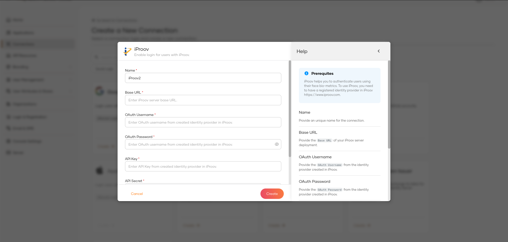

# Configuring iProov Authenticator
To use the iProov authenticator with WSO2 Identity Server, first you need to configure  the authenticator with
WSO2 Identity Server. See the instructions given below on how to configure iProov authenticator with
WSO2 Identity Server using a sample app.

To test this approach, the organization must have a service provider created in iProov portal should obtain
the relevant keys and secrets of the created service provider.

After deploying the iProov authenticator on WSO2 IS, the authenticator can be configured from the
WSO2 IS Console.

## Prerequisites
To use the connector, you'll need:

- A configured iProov service provider.

Note: Get the support from iProov to configure a iProov service provider via the iProov Portal.

## Setting up and installing the iProov connector

**Step 1:** Extracting the project artifacts
1. Clone the `identity-outbound-auth-iproov` repository.
2. Build the project by running ```mvn clean install``` in the root directory.

Note : The latest project artifacts can also be downloaded from the Connector Store.

**Step 2:** Deploying the iProov Authenticator

1. Navigate to `identity-outbound-auth-iproov/components` → `org.wso2.carbon.identity.application.authenticator.iproov`
   → `target`.
2. Copy the `org.wso2.carbon.identity.application.authenticator.iproov-<version>-SNAPSHOT.jar` file.
3. Navigate to `<IS_HOME>/repository/components/dropins`.
4. Paste the `.jar` file into the dropins directory.
5. Next, navigate to `identity-outbound-auth-iproov/components` →
   `org.wso2.carbon.identity.application.authenticator.iproov.common` → `target`.
6. Copy the `org.wso2.carbon.identity.application.authenticator.iproov.common-<version>-SNAPSHOT.jar` file.
7. Navigate to `<IS_HOME>/repository/components/lib` directory and paste the `.jar` file.
8. Navigate to `identity-outbound-auth-iproov/components` → `org.wso2.carbon.identity.application.authenticator.iproov`
   → `src/main/resources/artifacts` and copy the `iproov` directory.
9. Paste it into `<IS_HOME>/repository/resources/identity/extensions/connections` directory.
10. Navigate to `identity-outbound-auth-iproov/components` → `org.wso2.carbon.identity.application.authenticator.iproov`
   → `src/main/resources/artifacts` and copy the `guides` directory.
11. Paste it into `<IS_HOME>/repository/deployment/server/webapps/console/resources/connections/assets/images` directory.
12. Navigate to `identity-outbound-auth-iproov/components` → `org.wso2.carbon.identity.application.authenticator.iproov`
    → `src/main/resources/artifacts` and copy the `iproov.svg` file.
13. Paste it into following directories.
    - `<IS_HOME>/repository/deployment/server/webapps/authenticationendpoint/libs/themes/wso2is/assets/images/identity-providers/`

**Step 4:** Adding required identity claims to the product
1. Restart the WSO2 Identity Server.
2. Execute the following curl commands to add the required identity claims to the product.
```
    curl --location '<server-url>/t/<tenant-domain>/api/server/v1/claim-dialects/local/claims' \
    --header 'accept: application/json' \
    --header 'authorization: Basic <Base 64 encoded username:password>' \
    --header 'Content-Type: application/json' \
    --data '{
    "claimURI": "http://wso2.org/claims/identity/iproovEnrolled",
    "description": "Whether user is being enrolled with iProov",
    "displayOrder": 0,
    "displayName": "iProov enrolled",
    "readOnly": true,
    "regEx": "",
    "required": false,
    "supportedByDefault": false,
    "attributeMapping": [
    {
    "mappedAttribute": "iproovEnrolled",
    "userstore": "PRIMARY"
    }
    ]
    }'
```
```
    curl --location '<server-url>/t/<tenant-domain>/api/server/v1/claim-dialects/local/claims' \
    --header 'accept: application/json' \
    --header 'authorization: Basic  <Base 64 encoded username:password>' \
    --header 'Content-Type: application/json' \
    --data '{
    "claimURI": "http://wso2.org/claims/identity/failediProovAttempts",
    "description": "Failed iProov Attempts.",
    "displayOrder": 0,
    "displayName": "Failed iProov Attempts",
    "readOnly": true,
    "regEx": "",
    "required": false,
    "supportedByDefault": false,
    "attributeMapping": [
    {
    "mappedAttribute": "failediProovAttempts",
    "userstore": "PRIMARY"
    }
    ]
    }'
```

## The WSO2 console's UI for the iproov authenticator

The WSO2 Console's UI for the iproov connector enables developers to easily configure iproov
as an identity provider for their application. The UI offers a user-friendly and intuitive
interface for defining essential iproov credentials, such as base URL, oauth username, oauth password,
api key and api secret



### Base URL
This refers to the Base URL you received from iProov upon creating a service provider for your organization.
Example :

```
https://eu.rp.secure.iproov.me/api/v2
```

### Oauth username
This refers to the oauth username you received for the service provider you created in the iProov.
Example :
```
admin
```

### OAuth password
This refers to the oauth password you received for the service provider you created in the iProov.
Example :
```
*************************************51f
```

### API Key
This refers to the api key you received for the service provider you created in the iProov.
Example :
```
*************************************652
```

### API Secret
This refers to the secret key you received for the service provider you created in the iProov.
Example :
```
*************************************d19
```
